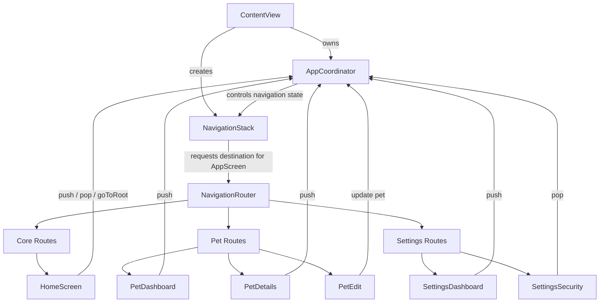
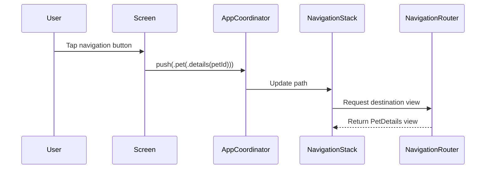
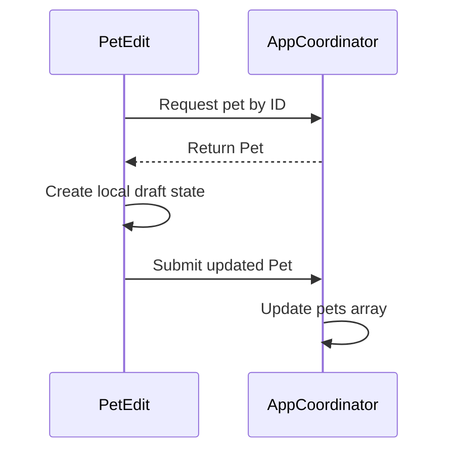

# Navigation Architecture

This project demonstrates a **coordinator-based navigation architecture** designed to
centralize navigation state and simplify deep navigation flows in SwiftUI applications.

The architecture separates navigation state, routing logic, and screen rendering
into clearly defined responsibilities.

---

## High-Level Architecture



---

## Component Responsibilities

### ContentView

`ContentView` is responsible for:

- owning the `AppCoordinator`
- creating the `NavigationStack`
- bootstrapping the application session
- injecting the coordinator into the SwiftUI environment

Example:

```swift
NavigationStack(path: $coordinator.path)
```

---

### AppCoordinator

The `AppCoordinator` acts as the **single source of truth for navigation state**.

It manages:

- the root screen
- the navigation stack
- route transitions
- session bootstrap logic
- shared demo data

Example navigation action:

```swift
coordinator.push(.pet(.details(petId)))
```

---

### NavigationRouter

The `NavigationRouter` is responsible for converting routes into SwiftUI views.

Example:

```swift
case .pet(.details(let petId)):
    return AnyView(PetDetails(petId: petId))
```

This keeps view construction separate from navigation logic.

---

### Screens

Screens focus only on:

- rendering UI
- sending navigation intent to the coordinator
- displaying data

Example:

```swift
coordinator.push(.pet(.edit(pet.id)))
```

---

## Navigation Flow

The following sequence illustrates how navigation occurs when a user interacts with the UI.



---

## Data Editing Flow

The edit flow demonstrates how screens can safely modify domain data
without directly mutating shared state during form editing.



---

## Benefits of This Architecture

This approach provides several advantages:

- **Centralized navigation state**
- **Type-safe routing**
- **Predictable navigation flows**
- **Separation of concerns**
- **Easier debugging**
- **Better scalability as applications grow**

By keeping navigation logic within a coordinator, SwiftUI screens remain
focused on UI concerns rather than routing decisions.

