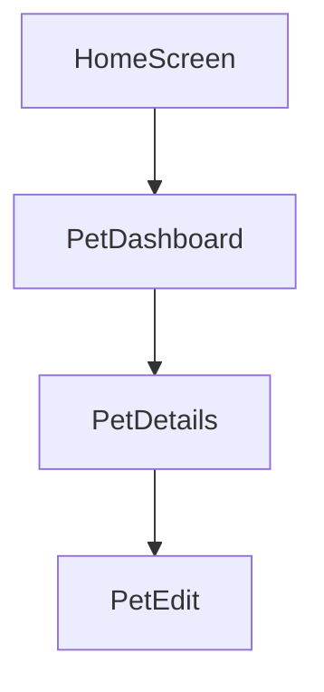
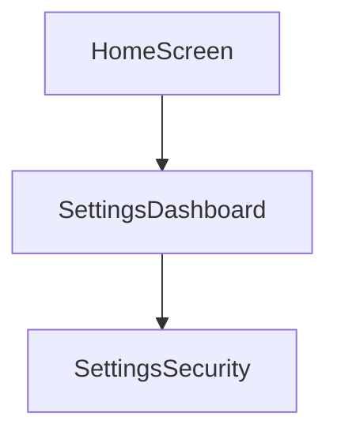

# Navigation Flow

This document illustrates how navigation flows through the demo application.

The goal of this project is to demonstrate how a **coordinator-based architecture**
can manage deep SwiftUI navigation in a predictable and centralized way.

---

## Primary Demo Flow

The main navigation example in this project follows a realistic pet management workflow.

```
Home
  → Pets Dashboard
  → Pet Details
  → Edit Pet
```

This demonstrates how navigation can move through multiple screens while the
`AppCoordinator` remains the single source of truth for navigation state.

---

## Flow Visualization



---

## Step-by-Step Navigation

### 1. Home → Pets Dashboard

The user taps **See Your Pets** on the home screen.

```swift
coordinator.push(.pet(.dashboard))
```

---

### 2. Pets Dashboard → Pet Details

The user selects a pet from the dashboard.

```swift
coordinator.push(.pet(.details(pet.id)))
```

---

### 3. Pet Details → Edit Pet

The user chooses to edit the pet information.

```swift
coordinator.push(.pet(.edit(pet.id)))
```

---

## Coordinator State Changes

Each navigation action updates the `NavigationStack` path managed by the coordinator.

Example state change:

Before navigation:

```
root = .core(.home)
path = []
```

After navigating to the dashboard:

```
root = .core(.home)
path = [.pet(.dashboard)]
```

After navigating to pet details:

```
root = .core(.home)
path = [
  .pet(.dashboard),
  .pet(.details(petId))
]
```

---

## Why This Matters

Without a coordinator, navigation logic often becomes distributed across many
SwiftUI views. As applications grow, this can lead to:

- fragile navigation flows
- difficult debugging
- tightly coupled UI and navigation logic

Using a centralized `AppCoordinator` allows:

- consistent navigation control
- easier reasoning about navigation state
- predictable deep navigation flows

---

## Additional Navigation Example

The project also includes a simple settings flow.

```
Home
  → Settings Dashboard
  → Security
```



These flows demonstrate how the coordinator can manage navigation across
multiple feature domains.
